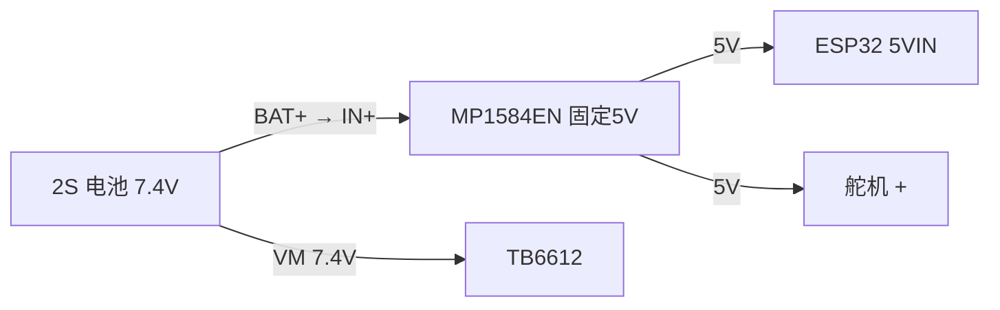
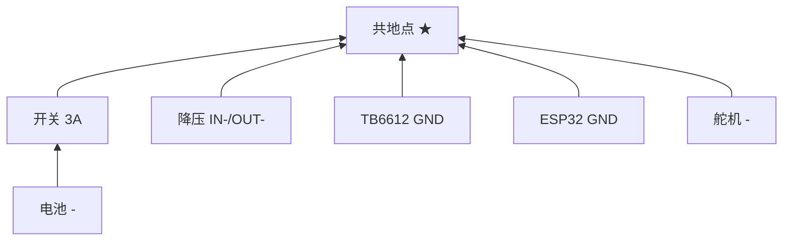
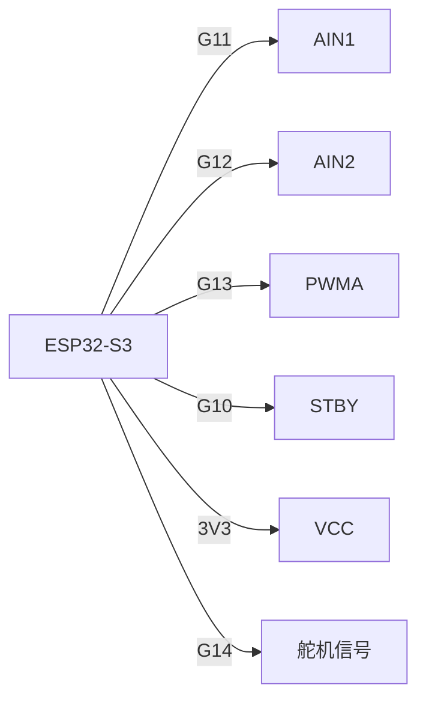
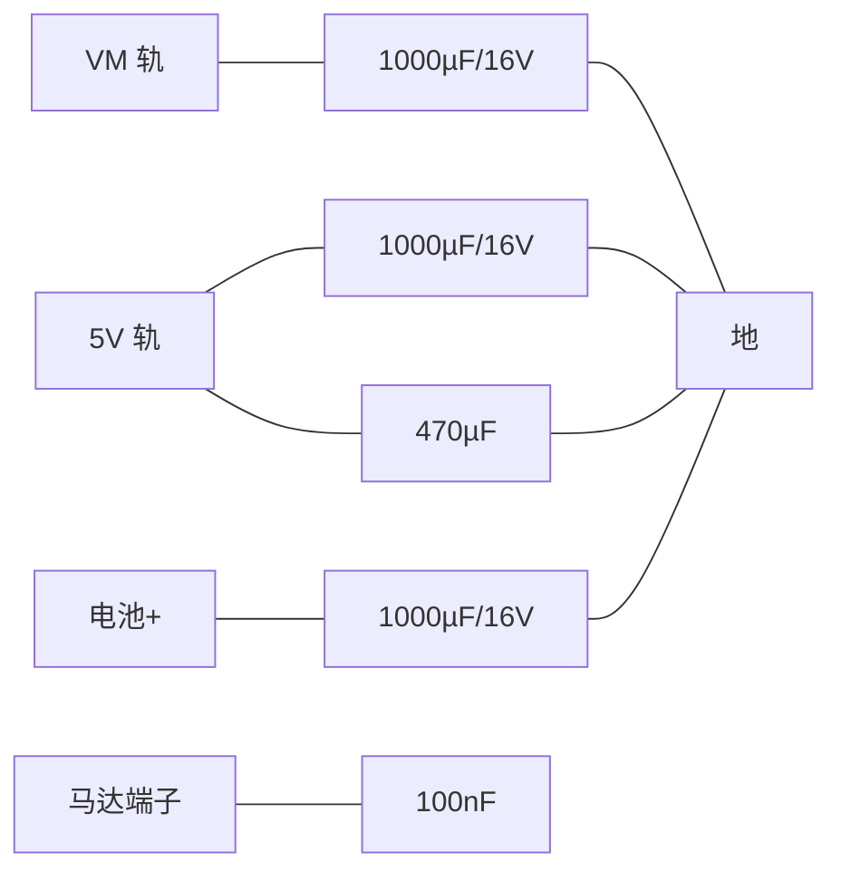

# 接线图 — 分域版（2026-08）

> 单张图塞全部信息必然乱。按域拆成四张小图，每张只有 5-7 条边。
> 焊线时以 `verification-wiring.md` 表格为准（对照实物），本图用于连通性检查。

## ① 电源

## ② 地线（星形）

## ③ 信号

## ④ 电容（每颗 = 轨 ↔ 地）

## 备注

- GPIO 为实接值：AIN1=G11 AIN2=G12 PWMA=G13 STBY=G10 舵机=G14
- 开关 3A/250VAC：2S 下踩线可用，3S 必须换 ≥5A/12VDC
- 全部电容负脚统一回共地点（单点地）
